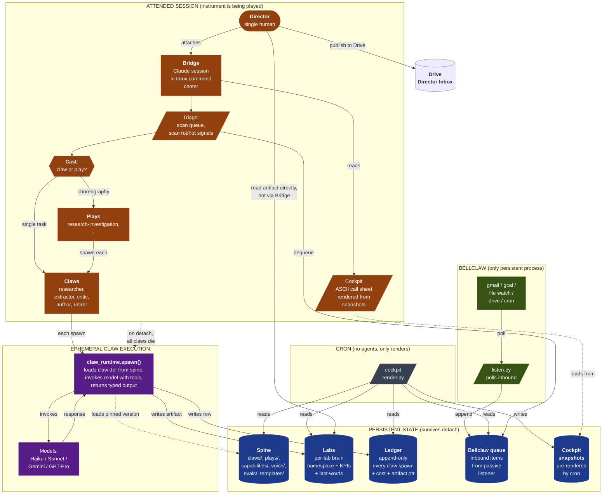

# Studio — Build Plan + Data Flow Diagram

This document translates `studio/SPEC.md` into a concrete buildable
system: which pieces already exist (and where), which need to be built,
in what order, and how the runtime data flow looks.

It is **not yet a commitment to build**. It is the artifact the
director reads to decide whether to commit.

## Part 1 — Component-by-Component Honest Map

For each spec component, three columns:

- **Today**: what currently exists in the lab that fills this role
- **Gap**: what's missing relative to the spec
- **Build cost**: rough effort if we commit (S = <1 session, M = 1-2 sessions, L = 3+ sessions)

| Component | Today | Gap | Cost |
|---|---|---|---|
| **Director's bridge** | tmux command center (`cgl-tmux`, 3-pane lab window) + Claude Code session in the director pane. Reads `STATUS.md`, dispatches via `cgl-delegate`, surfaces reports. | Bridge currently READS agent output and summarizes for director — spec says it shouldn't. Need a discipline change (not a build): bridge dispatches and surfaces pointers; director reads agent output directly. | S (discipline doc + checklist) |
| **Labs** | `surfaces/*` (4 dormant: Advisory/Systems/Tools/Studio); `research/` (1 active department); `trees/<arm>/` git worktrees per active arm. | No first-class **lab** abstraction with mission + persona + KPIs + brain namespace. Existing surfaces have READMEs but no formal "lab card." Research-dept is a one-off; not parameterized. | M (lab schema + scaffold + 1 lab migration as proof) |
| **Claws** | Cortex skills (~19) at user level + the bridge's hardcoded LLM calls (Haiku for extract/retire, Sonnet for author, Gemini for critique) | No **declarative claw catalog**. Each LLM call is hardcoded in `cortex_bridge.py`. No claw definition file with model/permissions/skills/tools/preamble/isolation. Claw spawning is implicit in driver code, not lifted. | M (claw schema + spawner + migrate 4 existing claws to declarative form) |
| **Plays** | The research-dept driver's hardcoded cycle (plan → survey → claim_extract → critique → retire → synthesize → decide) is one play, but it's not extracted. | No **plays catalog**. Driver has 6 phases hardcoded. To run a different play, you'd write a different driver. Need a play-runtime that interprets a play definition. | M (play schema + interpreter + lift research cycle as the first play) |
| **Spine** | `lab/.claude/skills/director/` (skills), `runbooks/` (procedures), `decisions/` (ADRs), `foundation/` (constitutional). Pull-only at runtime ✓ | No version pinning. No clear separation between "spine assets a lab pulls" vs "lab-internal stuff." Publication-as-intentional-act discipline isn't enforced — anything in `.claude/skills/director/` is implicitly spine. | S (formalize the spine boundary; add SEMVER metadata to claw/play/capability files) |
| **Capabilities** | `cgl-publish`, `cgl-delegate`, `cgl-tmux`, `cgl-send`, `cgl-status-pane`, `cgl-reports`, `cgl-publish` — all implicitly versioned by git commit. | No **capability bundle** format. No version pin in consumer code. No eval contract. A change to `cgl-delegate` could silently break dependent labs. | M (capability schema; semver tag scheme; pin syntax; eval-as-contract is a research question deferred per spec) |
| **Commons** | Doesn't exist | This is genuinely net-new. The lab today is the only studio. To build the commons, we need a 2nd studio first or we're guessing at the interface. | L (build only after a 2nd studio exists; defer indefinitely) |
| **Bellclaw (passive listener)** | Doesn't exist | Net-new. Needs: cron job, polled inbox sources (gmail via `g`, calendar via `g`, file watchers, telegram, drive new files), append-only queue file, no agent spawning. | M (single-process daemon with pluggable polling sources + JSONL queue) |
| **Ledger** | Distributed across `intel/publish-log.jsonl`, per-investigation `events.jsonl` + `costs.jsonl`. Unified for research dept; nothing global. | No **studio-level unified ledger**. Need: append-only `studio/ledger.jsonl` with rows for every claw spawn, play run, cost. Migrating per-investigation logs means writing a unifier. | S (add unified ledger writer; existing per-investigation jsonl stays; migration is read-only) |
| **Cockpit** | `cgl-status-pane` (auto-refresh federation snapshot in tmux) + `/director status` (deterministic state.json reflector) | Renders on-demand, not pre-rendered snapshots. Doesn't surface director-attention items (queue depth, rot risk, capability drift). Currently arm-centric, not director-attention-centric. | M (cockpit renderer + cron pre-render + rot-detection logic) |
| **Lifecycle** | Doesn't exist | Net-new. Today: idea → built in one session. No hunch/sandbox/incubate/lab/platformize/retire stages. No promotion gates. | M (lifecycle schema + promotion checks per stage + retire ritual) |

### Three things that genuinely don't exist (the actual build)

1. **Bellclaw** (passive listener daemon)
2. **Lifecycle gates** (staged-promotion discipline + checks)
3. **Two-level structure** (recipe vs. instance — today `lab/` IS the studio)

The other components have partial implementations or close analogs.

## Part 2 — Build Phases (with dependencies)

The work splits cleanly into 5 phases. Each phase is **shippable**
(closes a coherent capability) and **testable** (you can run it on a
real workload).

```
Phase 1: Formalize the spine (S–M)        ← no deps
Phase 2: Declarative claws + ledger (M)   ← depends on Phase 1
Phase 3: Plays as data (M)                ← depends on Phase 2
Phase 4: Cockpit + Bellclaw (M)           ← depends on Phase 2 ledger
Phase 5: Lifecycle gates (M)              ← depends on Phase 2-4
```

### Phase 1 — Formalize the spine boundary

**Goal**: name what's spine and what's not. Add SEMVER metadata. Define
the pull-only interface.

**Deliverables**:
- `studio/spine/` directory at lab root (separate from `.claude/skills/director/` initially; can merge later)
- `studio/spine/SCHEMA.md` documenting the four asset types in spine: claws, plays, capabilities, voice/persona/voice guides, evals, templates
- Each spine asset gets a YAML frontmatter with `name`, `version`, `kind`, `last_validated`, `status`
- Move existing director skills (`cgl-*` and the procedures) into spine via symlinks (preserving git history)
- Document the **publish-into-spine** ritual (single command, not a side effect of editing)

**Validation**: spine assets discoverable, versioned, loadable. Existing director skills still work.

**Risk**: small — purely organizational.

### Phase 2 — Declarative claws + unified ledger

**Goal**: turn the implicit LLM calls in `cortex_bridge.py` into named claws with declarative definitions. Land the studio-level ledger.

**Deliverables**:
- `studio/claws/` directory (in spine) — one YAML per claw type
  - `claws/researcher.yaml` (Gemini Pro power-search wrapper, what `cortex_bridge.research()` does today)
  - `claws/extractor.yaml` (Haiku claim extraction)
  - `claws/retirer.yaml` (Haiku retirement classifier)
  - `claws/critic.yaml` (Gemini Pro adversarial review)
  - `claws/author.yaml` (Sonnet narrative authoring)
- `studio/lib/claw_runtime.py` — interprets a claw definition + task input, calls the right model/tool, returns typed output
- `studio/ledger.jsonl` (append-only) — every claw spawn writes a row: `{ts, lab, claw, version, task, model, tokens_in, tokens_out, cost_usd, status, latency_s, artifact_path}`
- Migrate `cortex_bridge.py` methods to call `claw_runtime.spawn(claw_name, task)` instead of inlined LLM calls

**Validation**: re-run the production-ai-failure-modes investigation through the claw runtime. Final report should match v0.7 quality. Ledger should record one row per claw call.

**Risk**: medium — a refactor of the heart of the existing system. Needs the v0.7 investigation as a regression test.

### Phase 3 — Plays as data

**Goal**: lift the hardcoded driver-cycle into a play definition. Make plays composable.

**Deliverables**:
- `studio/plays/` directory (in spine) — one YAML per play
  - `plays/research-investigation-v1.yaml` — the existing 6-phase cycle, parameterized
- `studio/lib/play_runtime.py` — interprets a play YAML, drives state transitions, calls `claw_runtime.spawn()`, persists to ledger
- Migrate `research/lib/driver.py` to call `play_runtime.run(play="research-investigation-v1", contract=...)` instead of hardcoded phases
- Define the play schema: stages, transitions, claw bindings, handoff seams, abort conditions

**Validation**: same investigation runs through the play runtime end-to-end. The 6-phase logic is now data, not code.

**Risk**: medium — pulls the state machine into a config file. Need to handle the gnarly bits (resume semantics, retire-as-side-effect).

### Phase 4 — Cockpit + Bellclaw

**Goal**: build the director's attention surface. The two pieces that don't currently exist.

**Deliverables**:

**Cockpit**:
- `studio/cockpit/render.py` — reads ledger, lab state, queue, spine; produces ASCII call sheet
- `studio/cockpit/snapshots/` — pre-rendered cockpits, refreshed by cron
- Rot detector — flags labs whose `last_touched` is older than mission-defined threshold
- Inbox-depth signal — counts items in Bellclaw queue per lab
- Capability-drift signal — diffs lab's pinned capability versions against latest spine versions
- Wired into `cgl-tmux` as a new pane (replacing or augmenting `cgl-status-pane`)

**Bellclaw** (passive listener):
- `studio/bellclaw/listen.py` — a single Python process, runs as a systemd-style daemon (or just `nohup` for v1)
- Pluggable poller modules: `bellclaw/sources/gmail.py`, `bellclaw/sources/gcal.py`, `bellclaw/sources/file_watch.py`, `bellclaw/sources/drive_new_files.py`, `bellclaw/sources/cron_events.py`
- Each poller produces queue rows: `{ts, source, kind, summary, payload_path, lab_hint}`
- Output: append-only `studio/bellclaw/queue.jsonl`
- **Never spawns agents. Never decides. Never acts.**
- Triage CLI: `studio-triage` reads queue, lets director mark items as `dispatched | snoozed | killed | converted-to-task`

**Validation**: cockpit attaches in <2s with real signal. Bellclaw queues a test email + test calendar event without crashing. Triage moves items out of the queue.

**Risk**: medium — new processes, new credentials surface for Bellclaw pollers. Existing `g` CLI for gmail/calendar gives us auth for free.

### Phase 5 — Lifecycle gates

**Goal**: install the discipline mechanism. Make stage promotion explicit and gated.

**Deliverables**:
- `studio/lifecycle/STAGES.md` — defines hunch → sandbox → incubate → lab → platformize → retire with criteria per stage
- `studio/lifecycle/promote.py` — CLI: `studio-promote <slug> --to <stage>` runs the gate checks for that stage
- Gate checks per stage:
  - `hunch → sandbox`: brief written (≥200 words)
  - `sandbox → incubate`: charter exists, evals defined
  - `incubate → lab`: evals pass, KPIs declared, brain namespace allocated
  - `lab → platformize`: capability extracted + used by ≥2 labs
  - `* → retire`: retirement note explaining why + what was learned
- Each artifact in the lab gains a `stage:` frontmatter field
- Cockpit surfaces stage-rot (artifacts that have been at one stage past a threshold)

**Validation**: walk an existing artifact (e.g., the Meta ad work or the Carmacks/MagmaLab note) through the lifecycle CLI. Verify gates fire correctly. Verify retire ritual produces an honest note.

**Risk**: medium-high — friction is the point but also the failure mode. The director has to honor the gates or they become bureaucracy.

### Phase 6 (deferred) — Commons

**Goal**: cross-studio capability sharing.

**Deferred indefinitely** because there's only one studio today. Build only after a 2nd studio exists; otherwise we're designing in the abstract.

## Part 3 — Mermaid Diagram: Data Flow + Ops

> **Live, interactive version**: https://cairnlabs.org/diagrams/studio-architecture.html
>
> The page below renders the mermaid client-side at full vector
> fidelity with pan/zoom controls. This is the canonical surface
> for the diagram. The PNG-in-Drive-Doc version is a fallback —
> Google Docs caps width and occludes the layout.
>
> Source files in repo: `lab/studio/studio-flow.mmd` (mermaid source),
> `lab/web/cairnlabs.org/diagrams/studio-architecture.html` (live page).

The diagram below shows two views in one canvas: the **persistent state**
(left/bottom — what survives detach), the **attended-session compute**
(right/top — what only exists when director is playing the instrument),
and the **flow** between them through a typical session.



### What the diagram is saying

1. **Left/bottom is permanent**. Spine, labs, ledger, queue, snapshots are
   all on disk. Survive every detach.
2. **Top right is where work happens**. The session block only exists when
   the director is attached. Claws spawn, run, write to ledger + lab,
   die.
3. **Bellclaw is the only persistent process**. Always running. Never
   spawns agents. Just queues.
4. **Cron has no agents either**. It just pre-renders cockpit snapshots
   from the persistent state. So when the director attaches, the
   cockpit is instant.
5. **The bridge does NOT read claw output**. The director reads artifacts
   directly from the lab. The bridge dispatches and surfaces pointers.
   (This is the discipline change in Phase 1, not the build.)

### What the diagram does NOT show (intentional simplification)

- The lifecycle (Phase 5) doesn't appear in the runtime diagram because
  it's a meta-process, not a runtime flow. Lifecycle gates apply when
  artifacts are promoted between stages, not during normal session
  flow.
- The commons (Phase 6, deferred) doesn't appear because it doesn't
  exist yet.
- Multiple studios don't appear — single-studio view.
- Drive auto-publish appears as a leaf because today it's a side
  effect of certain claws (the author claw); in the spec it's the
  director's manual choice.

## Part 4 — Recommended path forward

Three options, ordered by aggression:

### Option R1 — Full build (8-12 sessions over 3-6 weeks)

Run all 5 phases sequentially. Each phase shipped + validated before the
next starts. End state: studio is a real meta-framework, lab/ is the
reference instance.

### Option R2 — Skinny build (4-5 sessions)

Phases 1, 2, 4 only. Skip plays-as-data (keep driver hardcoded) and
skip lifecycle (keep informal). Bellclaw + cockpit + ledger are the
biggest user-facing wins. Defer spec compliance.

### Option R3 — Validate-by-use first (recommended)

**Don't build yet.** Take the spec + this build plan + the v0.7 final
report into validate-by-use mode. Run a real workload — commission
another investigation, activate a surface, do real Advisory work — and
see which spec components actually serve and which are aspirational.
**Then** build only what proved necessary.

The risk of building first: we ship a meta-framework that's well-
designed but doesn't fit the actual work patterns that emerge.

The risk of validating first: lifecycle gates are exactly the kind of
discipline that doesn't emerge organically — the director has to
install them deliberately. Validate-by-use might never surface the
need.

**My recommendation**: R3, with one carve-out. **Build Bellclaw now**
(Phase 4's listener half) regardless of which option you pick. It's
genuinely missing. The Meta ad you commissioned is sitting in review
with no triage path. Without Bellclaw, the director keeps having to
remember to check things manually.

If you do nothing else, build the listener.

## Part 5 — Open questions before any build commitment

Six things I'd want you to answer before I start writing code:

1. **Is the bridge-doesn't-read discipline real, or aspirational?** This
   is the largest single behavioral change. Are you actually going to
   resist asking me to summarize claw output, or is "summarize for me"
   load-bearing?

2. **Lab vs. department vs. surface**. The spec uses "lab." Today we
   have surfaces (customer-facing) and departments (internal-facing).
   Are labs the same as departments, or a third concept? Naming
   matters.

3. **Studio = lab/ or studio-of-labs?** The spec separates recipe
   (meta-framework) from instance (one studio). Today `lab/` is the
   only studio. To realize the two-level structure, do we move the
   recipe out of `lab/` and into `~/studio-recipe/` (or similar), or
   leave it inside `lab/studio/` and treat the rest of `lab/` as the
   instance?

4. **What's the second studio?** The commons only makes sense with two
   studios. Is there a real second one (personal/family/open-source)
   waiting, or is multi-studio a hypothetical?

5. **Lifecycle stages — what's the bar for each gate?** "Brief written"
   is concrete; "evals pass" needs evals to exist. Some gates are
   measurable, others are subjective. Are we OK with subjective gates
   if the director honors them?

6. **Cost ledger granularity**. Per-claw-spawn is the obvious unit. But
   the spec also mentions plays and lifecycle stages. Roll up cost by
   play? By stage? By lab? By all three?

## Where this lives

- This file: `lab/studio/BUILD_PLAN.md`
- The original spec: `lab/studio/SPEC.md`
- The studio README + status: `lab/studio/README.md`

Published to the Director Inbox in Drive alongside the spec.

## What's next

If R3 (validate-by-use first), nothing builds. The director reads the
spec, the v0.7 final report, and this plan. Comes back when there's
clarity on the open questions above.

If R1 or R2, Phase 1 is the unblocker — formalize the spine boundary
first, then everything else has a stable foundation.
